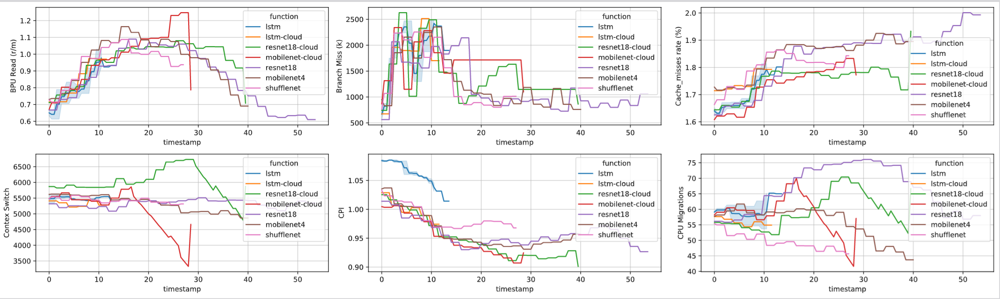

## Benchmark for Deep Learning Inference in Edge-Mobile Serverless Environments

[English]

Welcome to our GitHub repository for a benchmark designed for deep learning inference in edge-mobile environments. 

In this repository, we provide data, experiment scripts, and plotting scripts used in the benchmarking process. Our goal is to evaluate the performance and efficiency of deep learning models when running inference tasks on edge devices and mobile platforms. 

Feel free to explore the repository and use the benchmark to assess the inference capabilities of different models in edge-mobile environments. We hope this benchmark will contribute to the advancement of deep learning techniques in resource-constrained settings.

---

1. **Deployment**
    - **Prometheus**: Prometheus is a monitoring system and time-series database. It collects and stores metrics from specified targets at given intervals, evaluating rule expressions, displaying the results, and can trigger alerts if certain conditions are observed to be true.
        - Instructions might be included on how to set up Prometheus on a Kubernetes, K3s, or KubeEdge cluster, how to configure it to scrape metrics from your applications, and how to access the Prometheus web UI.
    
    - **Kubernetes**: Kubernetes is an open-source platform designed to automate deploying, scaling, and operating application containers. 
        - Here, instructions would be given on how to deploy a Kubernetes cluster, possibly using a cloud service or setting up a local one with tools like Minikube or kops. Also, it would guide the user on how to verify the cluster is up and running and possibly some basic usage commands.
        
    - **K3s**: K3s is a lightweight, certified Kubernetes distribution developed by Rancher Labs. It's targeted at edge and IoT environments and perfect for situations where a full-fledged Kubernetes isn't necessary.
        - In this section, the instructions on how to deploy a K3s cluster would be given, including how to add nodes to the cluster, how to check the status of the cluster, and some basic commands for managing workloads on K3s.

    - **OpenFaaS**: OpenFaaS is an open-source framework that makes it easy to deploy serverless functions to a Kubernetes cluster. 
        - This section would guide the user on how to deploy OpenFaaS to the aforementioned clusters, how to deploy functions to OpenFaaS, and how to invoke those functions.

2. **Experiment Scripts**
    - This section would likely provide scripts that run a series of workloads or experiments on the deployed clusters, possibly testing the performance, scaling characteristics, and reliability of serverless functions on different hardware and configurations.
    
    
3. **Data Analysis**
    - After running the experiments, this section would likely provide scripts to parse the results, maybe using a language like Python with data analysis libraries like pandas, numpy, and matplotlib. These scripts would help analyze the data collected from the experiments, generate figures, compute statistics, etc.
